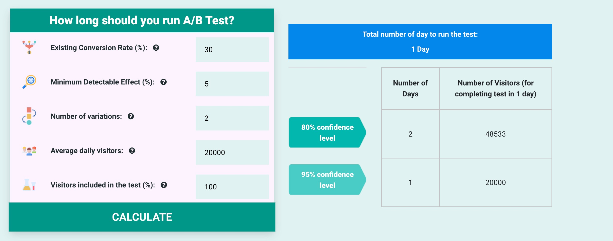
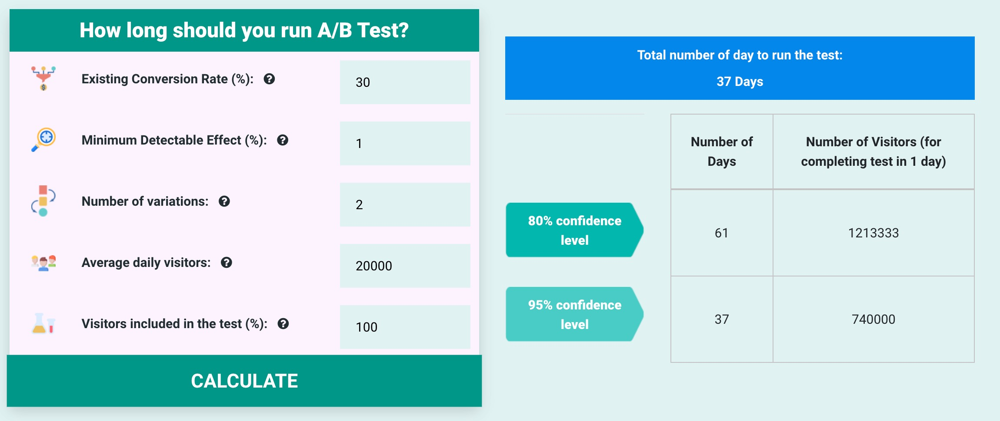

# A/B Testing 101

Objectives : 

1. Basics of A/B testing
1. Experiments as a form of validation
1. Hypothesis generation and measurement

---
#### # Basics of A/B testing

> Question: How many changes do you track in a single A/B Test ? 

_Answer  : In A/B Tests we only change a single variable ( eg . Size of picture / Color of CTA button ) in the Base ( A ) , to create the **Variant** ( B ). And then , we keep an eye on the metrics to see if Variant produced the type of results we expected or not_

>  Question : Why do we only change a single variable, why not change multiple things all at once and see how well that version with multiple changes did with respect to the Base ? 

_Answer : The data is not concussive , if we track the effect multiple changes had in an experiment. So A/B tests only have a single change between the **Base** and the **Variant**.   
In this way we can be sure the variation in data was only because of tha SINGLE change_

`Eg : If we change the size of a `[ Buy Now ]` button , and if the sales went up by 25% , we can conclusively say that increasing the size of the button , in itself , had that effect on the sales`

> Question : How long should you run an A / B Test ? 

_Answer : Well, that answer depends on 2 factors_   
  + How much traffic do you need to measure it effectively.    
  + What is the minimum change that you want to detect ? . 
 
 Generally, the more GRANULAR the change you want to detect, the LONGER you need.   

Eg :    If you want to detect a 1% increase in sales , you need to run the experiment over 30 days.    
V.S    
If you want a 5% increase detected , then you just need to run it 1 or 2 days .

---

[A/B test runtime calculator](https://www.nabler.com/ab-test-duration-calculator/ 'Calculate the time required to run an A/B test experiment')

---

---
#### # Experiments as a form of Validation

There are `4 metrics` which are used to evaluate the results of an experiment you conduct w.r.t your product 

1. **Primary Metric ( Generally the North Star Metric )** :
    
   + Eg. No. of Likes / No. of Subscribers / Sales
   + If the change in this metric is STATISTICALLY SIGNIFICANT , then you can conclusively say whether the impact of the change was Positive or Negative .

1. **Supporting Metric** :
    + There can be only 1 primary metric, but there can be multiple supporting metrics .
    + These are metrics , that hint towards the experiment going in the right/wrong direction 
    + Eg. If you take Amazon , and if while conduction an experiment you find there there is a decrease in the number of returns / cancellations and lesser number of customer support calls etc. , then this points towards your primary metric being met , in the near future.

1. **Health Metric** : 
   + This is generally a measure of how the application ( website ) is performing because of the experiment.
   + Eg :  Are there more errors on the backend ?   Has the page load time increased ? etc ...

1. **Binomial Goals** :
    + These are metrics that are tracked when any experiment is being performed , and are not specific to any experiment
    + These are metrics that can hint , or provide info about any other parameters being effected because of an experiment.
    + They are generally YES / NO tests . 
    + Eg. Has the bounce rate of the page increased after the start of the experiment ( Yes / No )

---
#### # Hypothesis generation and measurement

> What can be achieved my hypothesizing , and thereby running experiments to verify a hypothesis w.r.t Business Success ? 

> 